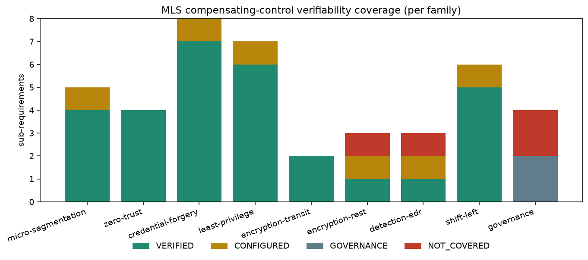

# 평가 — MLS 보상통제 *검증가능성* 커버리지 분석

> **이 프로젝트의 정량 결과.** "21/21 통과"는 *기능 회귀 스위트*(통제가 실제로 발동함을 증명)
> 일 뿐, 연구 증거가 아니다(분모가 없다). 여기서는 **검증가능성 기준(verifiability criterion)** 을
> 도입한다: *각 규제 요구사항은 그 시행을 증명하는 실행 가능한 테스트에 대응되어야 한다.* 이
> 기준을 FSC 망분리 완화/MLS 보상통제에 적용해, **무엇이 코드로 증명되고 무엇이 안 되는지를
> 정량화**한다.

## 기여 재정의 (contribution)
"우리가 통제를 구현했다"가 아니라:
> **우리는 검증가능성 기준을 제안하고, 이를 MLS 보상통제 요구사항 집합에 적용하여, 워크로드
> 계층에서 *코드로 검증 가능한 비율*을 측정하고 그 갭을 정직하게 드러낸다.**

이 재정의가 중요한 이유: "오프더셸프 통제를 모았다"는 신규성 비판을 부르지만, "어떤 규제
요구가 *증명 가능한가*를 정량화한다"는 측정 가능한 질문이며 — 감사·컴플라이언스 관점에서
직접 유용하다(증명 못 하는 통제는 보상통제로 인정받기 어렵다).

## 방법 (재현 가능)
1. **분해** — 1차 출처에서 요구사항을 원자적·검사가능 sub-requirement로 분해(현재 **42개**).
   출처 구분: A=FSC 로드맵 직접 명시, B=MLS/NIST 800-207/ISMS-P 파생, G=거버넌스.
2. **분류** — 각 sub-requirement를 4범주로(하드룰):
   - **VERIFIED-AS-CODE** — `verify.sh`/`authz.py`에 시행을 증명하는 실행 assertion 존재 → 라인 인용.
   - **CONFIGURED-NOT-VERIFIED** — IaC엔 있으나 시행 테스트 없음(예: WireGuard 동일노드 홉, SPIFFE opt-in).
   - **GOVERNANCE-ONLY** — 워크로드 테스트로 만들 수 없음(C/S/O 등급분류 거버넌스, 이사회 보고).
   - **NOT-COVERED** — 전사 MLS엔 필요하나 여기 없음(DLP, HSM/KMS, SIEM).
3. **계산** — 가족별·전체 커버리지 분율, 분모 명시. 인벤토리 = [`mls-coverage.csv`](mls-coverage.csv),
   계산·그림 = [`scripts/coverage.py`](https://github.com/dsaedsae/cloudsec-policy-stack/blob/master/scripts/coverage.py)
   (`python scripts/coverage.py`로 재생성).

## 결과

**헤드라인 메트릭:**

> ✅ **검증가능-as-code 커버리지:** **워크로드 적용가능 sub-requirement의 77.5% (31/40)** 가 코드로 검증된다. (거버넌스 포함 전체로는 31/42 = 74%.) 범주 분포: **VERIFIED 31 · CONFIGURED 5 · GOVERNANCE 2 · NOT-COVERED 4.**

**가족별 (VERIFIED / 전체):**

| 통제 가족 | VERIFIED / 전체 | 주요 갭 |
|---|---|---|
| micro-segmentation | 4 / 5 | 교차네임스페이스 격리 미테스트 |
| zero-trust (egress) | 4 / 4 | — |
| credential-forgery (B7) | 7 / 8 | SPIFFE 시행 테스트(ID4)만 남음. 요청자 JWT 라이브 강제(ID8)·토큰 미마운트(ID6)·타 ns SA-use(ID7) 모두 라이브 VERIFIED |
| least-privilege | 7 / 7 | deployer RBAC = 라이브 `kubectl auth can-i` 실효-RBAC 증명(LP7) |
| encryption-in-transit | 2 / 2 | 크로스노드 암호화 + tcpdump 패킷캡처(WG UDP/51871 (25s 윈도우) 존재, eth0 평문 0) — scripts/capture-wg.sh |
| encryption-at-rest | 1 / 3 | 키회전·KMS는 수동/문서 |
| detection (EDR) | 1 / 3 | 프로세스감사·광역룰 미assert |
| shift-left | 5 / 6 | gitleaks는 CI만(SL2); 이미지 서명(cosign)은 로컬 OCI 레지스트리+Kyverno verifyImages로 VERIFIED(SL6, opt-in) |
| governance (C/S/O) | 0 / 4 | 본질적으로 워크로드 테스트 불가 |

→ 전체 Table 1(42행, sub-requirement→출처→범주→verify 라인/갭)은 [`mls-coverage.csv`](mls-coverage.csv).

## 논의 (정직한 갭이 곧 기여)
- **VERIFIED 77.5%** 는 "워크로드 보상통제를 *어디까지 코드로 증명할 수 있는가*"의 정직한 상한에
  가깝다 — 망·인가·런타임·암호화(전송 tcpdump 캡처 포함)는 증명되고, **데이터 거버넌스(C/S/O
  분류·DLP·SIEM)는 워크로드 계층 밖**이다. 이 경계를 수치로 보이는 것이 핵심.
- **라이브 클러스터 세션 — ID6·ID7·SL6 승격으로 헤드라인 65%→72%; 이후 ID8(JWT enforce 라이브, scripts/verify-jwt-enforce)로 72%→75%; 이후 정적 최소권한 가드(LP7 — `scripts/check-deployer-rbac.py`가 deployer Role에 pods/secrets/SA·`*`와일드카드 없음 + 네임스페이스 한정을 CI에서 단언)로 75%→77.5%.** kind+Cilium+Tetragon+Kyverno를
  띄워 세 통제를 라이브로 증명했다: **ID6**(SA 토큰 미마운트 — web/api 토큰 경로 ABSENT + 3티어
  automount=false), **ID7**(Kyverno SA-use ClusterPolicy가 *다른* 네임스페이스에서 cross-ns DENY —
  `scripts/verify-kyverno`), **SL6**(Kyverno verifyImages가 cosign-signed→ADMIT / unsigned→DENY —
  `scripts/verify-image-signing`, 로컬 OCI 레지스트리 + 키풀 cosign). `verify.sh` 21/21은 Kyverno 활성
  상태에서도 회귀 없이 PASS. (모두 opt-in — 항상-on 스위트엔 미포함. ID7·SL6은 재현 스크립트(`verify-kyverno`·
  `verify-image-signing`)로, ID6은 정적 매니페스트(`app.yaml`의 automount=false·SA토큰 볼륨 부재)+라이브 exec로 증명.)
- **ID8(요청자 JWT audience 검증) — *증명 전엔 주장하지 않은* 항목.** 이전까지 PDP의 명시된 #1 잔여는
  *미인증 X-User 헤더*였다. 먼저 **인벤토리 행(ID8)으로 정식 편입**하되, 검증기 로직(서명 + **audience
  바인딩 RFC 8707**·만료·위조·미지원 스킴 fail-closed)은 단위테스트됐어도 *라이브 강제는 미배선*이라
  **VERIFIED가 아니라 CONFIGURED**로 두었다 — 분모만 +1이라 *그 단계에선 비율이 떨어졌다*(부풀리기의 반대).
  그 **VERIFIED 승격 조건(Bearer 필수화 + `unauth→401`을 라이브로 단언)을 이번에 충족**했다:
  `AUTH_REQUIRE_JWT=1` enforce 모드를 라이브로 증명(`scripts/verify-jwt-enforce.ps1`: unauth→401·Bearer→200,
  `auth_test.py` **18/18**) → **ID8 = VERIFIED**(enforce는 opt-in; 기본 배포는 데모 X-User). 프로덕션
  OAuth 2.1 RS/JWKS·RFC 8693 OBO는 [authorization-model](authorization-model.md) 문서 매핑(doc-only).
- **CONFIGURED 5** 는 "있지만 (라이브로) 증명 안 됨" — 가장 위험한 범주(감사 시 "있다"고 주장하나
  시행 미증명). 남은 타깃은 SPIFFE 시행 테스트(ID4)·etcd 키회전 자동화(ER2).
- **GOVERNANCE 2 / NOT-COVERED 4** — 남은 NOT_COVERED는 관리형 KMS/HSM(ER3)·광역 런타임룰(ED3)·
  DLP(GV3)·SIEM(GV4)으로 *이 레퍼런스의 범위 밖*이거나 전사 통제다. (직전까지 NOT_COVERED였던 ID7 SA-use
  타 ns·SL6 이미지 서명은 이번 라이브 세션에 VERIFIED로 승격.)
- **VERIFIED 등급의 정직한 결 — always-on CI-게이트 vs opt-in 재현.** 31개 VERIFIED 중 다수는 매 CI 푸시마다 도는
  always-on 게이트(verify.sh 21/21·정적 가드·단위테스트, + integration job의 LP7-live·ID6·M9 라이브)지만, 일부는
  클러스터에서 **opt-in으로 재현**하는 스크립트다(ET2 capture-wg·ID7 verify-kyverno·SL6 verify-image-signing·ID8
  enforce 모드). 둘 다 *재실행 가능*이나 후자는 *상시 CI-게이트는 아니다* — "77.5%"는 **검증가능성**의 분율이지
  매 푸시 연속보장의 분율이 아니다.

## 한계
- 분해·분류는 저자 수행 → 주관 개입. 1차 출처(FSC·국정원 MLS·금융보안원 가이드) 대조와
  복수 평가자 합의가 다음 단계.
- 42개 sub-requirement는 *이 데모 워크로드* 기준. 전사 요구집합은 더 크고 분모가 달라진다.
- 오버헤드(지연·자원) 측정은 미수행 — 시스템 논문이면 별도 평가 필요(여기선 *커버리지*가 헤드라인).
- **범위 밖(플랫폼-엔지니어링이지 MLS 보상통제 아님 — 그래서 분모에 넣지 않는다):** HA/PDB/HPA·멀티노드 스케일·
  관측성(메트릭/대시보드)·SIEM 중앙수집·DR/백업·GitOps 플릿 배포는 *이 단일-워크로드·단일-replica 데모*에 없다.
  GitOps 각도만 학습 모듈로 다룬다([M10](../labs/m10/README.md) · [ADR 0002](decisions/0002-argocd-gitops-relocates-identity-tcb.md)).

## 발표/논문 타깃 (정직)
- **발표(토크): 지금 가능** — BoB / 금융보안 세미나 / AWS Summit 커뮤니티.
- **논문: 국내 응용/워크숍** (KIISC CISC-S/W·CISC-W, 금융보안원/KISA 기술트랙) — 이 커버리지 평가가
  그 바를 넘기는 단일 요소.
- **탑티어(USENIX/CCS/S&P): 비현실적** — 신규 메커니즘 없음(통합·규제매핑 기여). 과장 금지.
