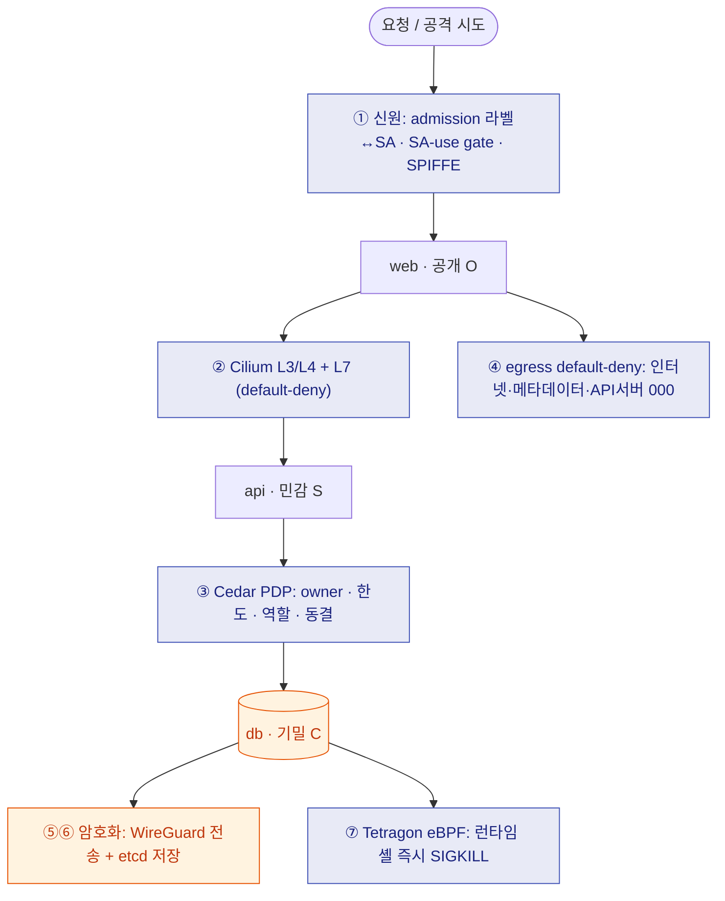

---
hide:
  - navigation
---

# 망분리를 풀면, 신뢰를 무엇으로 대체하는가

**검증 가능한 다층보안(MLS) 보상통제를 코드로 — 한 요청이 신원·세분화·인가·암호화·탐지를
전부 통과해야 데이터에 닿는다. 그리고 그 사실을 매번 라이브로 증명한다.**

!!! abstract "한 문단 요약"
    한국 금융권은 10년간 **물리/논리 망분리**로 보안을 유지했다. FSC 「금융분야 망분리 개선
    로드맵」(2024-08-13)이 이를 위험기반 **다층보안(MLS)** 으로 전환하면서, "네트워크 위치로
    신뢰"가 사라진 자리를 **보상통제(compensating controls)** 로 메워야 한다. 이 프로젝트는
    그 보상통제를 **하나의 워크로드 위에 코드로 구현하고, 20개 통제를 라이브로 검증**한
    재현 가능한 레퍼런스다. 적대적(LLM) 재검토가 우리 자신의 인가 정책에서 **실제 우회 취약점**
    을 찾아 수정한 과정까지 정직하게 포함한다.

---

## 왜 중요한가 (the problem)

=== "전 — 망분리"

    ```
    인터넷망  ══(에어갭)══  업무망     "경계만 지키면 안쪽은 평평하게 신뢰"
    ```
    안전하지만 SaaS·클라우드·생성형 AI·개발도구가 막혀 경쟁력이 떨어진다.

=== "후 — MLS (망분리 완화)"

    ```
    "업무 목적에 따라 통제된 연결"     위치 ≠ 신뢰
    데이터 등급 C/S/O · 등급별 차등 · 다층 보상통제
    ```
    망을 풀면 **그 신뢰를 보상통제로 대체**해야 한다 — 바로 이 프로젝트가 구현·검증하는 것.

> 망분리 완화의 안전성은 보상통제가 *실제로 막는지*에 달렸다 — 슬라이드가 아니라 **실행과 검증**으로.

---

## 무엇을 한 요청이 통과하는가 (the architecture)



거친 통제(RBAC·세분화) → 세밀한 통제(ABAC·per-request)를 **순서대로** 통과해야 데이터에 닿는다.
같은 네트워크 경로·같은 L7 허용 경로라도 **principal이 다르면 결과가 다르다**(alice 200 vs bob 403).

---

## 기여 (contributions)

<div class="grid cards" markdown>

-   :material-map-marker-path: **규제 → 통제 매핑**

    FSC 망분리 완화/MLS 보상통제 6종을 NIST SP 800-207·ISMS-P·**검증 항목**에 1:1 매핑.
    [→ MLS 매핑](docs/financial-mls-mapping.md)

-   :material-check-decagram: **검증가능성 기준 + 커버리지 측정**

    "각 규제 요구는 시행을 증명하는 실행 테스트에 대응돼야 한다"를 기준으로 삼고, MLS 보상통제의
    **61%가 코드로 검증가능**함을 *정량화*(갭 공개). [→ 평가](docs/evaluation-coverage.md)

-   :material-shield-bug: **정직한 적대적 검증**

    LLM 멀티에이전트 재검토가 **우리 SA-use 정책의 실제 우회(CRITICAL)** 를 발견 → 수정 →
    라이브 재검증. 과대주장 대신 잔여위험 명시.

-   :material-scale-balance: **현재 인가 흐름에 정렬**

    RBAC+ABAC 하이브리드 · policy-as-code · 지속평가. ReBAC는 정직한 갭.
    [→ 인가 모델](docs/authorization-model.md)

</div>

---

## 핵심 결과

| 항목 | 결과 |
|------|------|
| **검증가능성 커버리지 (정량 헤드라인)** | 워크로드 적용가능 MLS 보상통제 sub-requirement의 **61% (22/36)** 가 *코드로 검증* — 갭(CONFIGURED 8·NOT-COVERED 6·GOVERNANCE 2)을 정직하게 공개. [→ 평가](docs/evaluation-coverage.md) |
| 라이브 방어심층 검증 (기능 회귀 스위트) | **21 / 21 PASS** — 20개는 차단/허용 *enforcement* 증명 + 1개는 WireGuard *기능 활성*(단일워커라 노드간만) |
| Cedar 인가 단위테스트 | **8 / 8** |
| checkov shift-left | **452 pass / 0 fail / 5 documented skip** |
| 적대적 검토가 찾은 실제 버그 | **CRITICAL 1** (SA-use 우회) + 다수 — 전부 수정·검증 |
| 비용 | **$0** (무료 로컬 kind; AWS 경로는 가격대별 가이드) |

---

## 어디로 갈 것인가

<div class="grid cards" markdown>

-   **처음이면** → [실습 랩 0–5](docs/README.md) (Lab 0은 Python만, 5분)
-   **왜 중요한지** → [금융 망분리 완화 매핑](docs/financial-mls-mapping.md) · [위협 모델](THREAT_MODEL.md)
-   **운영** → [런북](runbooks/README.md) · **클라우드+비용** → [AWS 경로](docs/aws-eks-path.md)
-   **발표** → [토크 아웃라인](presentation/talk-outline.md)

</div>

!!! note "정직 메모"
    이것은 *워크로드 보상통제 레이어*의 레퍼런스다 — 인증서가 아니다. 실 데이터스토어 없음,
    X-User는 미인증 데모 입력, WireGuard는 단일워커라 노드간만, 규제 세부는 1차 출처 대조 필요.
    한계를 명시하는 것 자체가 MLS의 "자율보안·정직성"에 부합한다.
