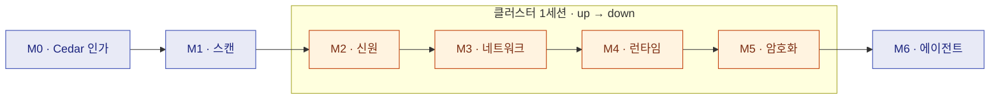

# 재구현 트랙 — 직접 만들며 전문가가 된다

이 스택의 모든 통제는 **실행 가능한 검증**(verify 스위트·단위테스트)을 갖고 있다. 이 트랙은
그 검증기를 **자동 채점기**로 뒤집는다: 통제 하나를 **빈 파일에서 직접 재구현**하면 채점기가
PASS/FAIL로 판정한다. 따라치기가 아니라 — 스펙만 보고 쓰고, 틀리면 *왜* 틀렸는지 채점으로 배운다.

!!! tip "처음이라면 — 먼저 환경 준비"
    **[환경 준비 (SETUP)](SETUP.md)** 를 1분 보고(클론엔 `.venv`가 없다), 그다음 **[M0](m0/README.md)**.
    클러스터 없이 Python만으로 5분이면 첫 채점을 본다. 무엇이 빠졌는지 한 번에 보려면
    `powershell -File scripts\doctor.ps1`.

!!! note "돌아온 학습자 / 면접 직전"
    각 모듈의 **구두 문답**(접힌 답안)으로 복습하라. 어느 모듈이든 사이드바에서 1클릭으로 점프.

## 모듈 사다리



??? abstract "각 모듈의 학습 루프 (strip → rebuild → 채점 → 복원)"
    ```mermaid
    flowchart LR
        K[스켈레톤<br/>strip된 통제] --> W["내가 작성<br/>labs/m·/ 만 편집"]
        W --> G{{"채점기 = 유일한 판정자"}}
        G -- FAIL --> W
        G -- PASS --> R[canonical<br/>자동 복원]
        classDef judge fill:#1a1a2e,stroke:#3f51b5,color:#a5d6a7;
        class G judge;
    ```
    클러스터 채점기는 학습자 아티팩트를 적용해 검증한 뒤 **canonical 정책을 자동 복원**한다 —
    스택은 항상 known-good 상태로 돌아온다.

## 한눈에 — 모듈별 스택 · 시간 · 비용

> ⏱ 시간은 *졸업까지의 대략치*(읽기 + 재구현 + break/fix 포함) — **첫 채점은 ~5분**으로 훨씬 빠르다. 💵 비용은 **전부 로컬 $0** —
> 클러스터 랩의 진짜 비용은 돈이 아니라 **RAM ~6–8GB**다. AWS는 *선택*(관리형 등가물 단발 체험 ~$1–3/세션;
> 끄는 걸 잊으면 월 $178 함정) → [비용 사다리](../docs/aws-eks-path.md).
> **M0가 가장 길다**(~3–6h) — Cedar 문법 + 핵심 사고(통과≠증명)를 처음 익히기 때문. 이후 **클러스터 랩(M2–M5)은 짧다**(스택은 무겁지만 작성량은 적다). 부담되면 M0의 5분 첫 채점만 먼저 보고 와도 된다.
> 🧭 트랙 = **코어 7(M0–M6) + 심화 2(M7–M8)**. 진도 카운터 'N / 7'은 코어 기준이고, M7·M8은 졸업 후 선택하는 심화다.

| 모듈 | 스택 | 하는 일 (졸업 기준) | 클러스터 | ~시간 | 비용 |
|---|---|---|---|---|---|
| **[M0](m0/README.md)** | Cedar | 인가 정책을 빈 파일에서 재구현 (11/11) | 불필요 (Python) | ~3–6h | **$0** 로컬 |
| **[M1](m1/README.md)** | checkov | IaC 결함 16개 사냥·수정 (Failed 0) | 불필요 (Python) | ~1.5–3h | **$0** 로컬 |
| **[M2](m2/README.md)** | VAP + CEL | 라벨↔SA admission CEL 작성 (5/5) | 필요 · RAM ~6–8GB | ~30–45m | **$0** 로컬 |
| **[M3](m3/README.md)** | Cilium L3/L7 | 최소권한 네트워크 홉 재구성 (7/7) | 필요 · RAM ~6–8GB | ~30–45m | **$0** 로컬 |
| **[M4](m4/README.md)** | Tetragon eBPF | 선택적 셸 SIGKILL 룰 (id=0·sh=137) | 필요 · RAM ~6–8GB | ~20–35m | **$0** 로컬 |
| **[M5](m5/README.md)** | WireGuard + etcd | 전송·저장 암호화 실행·해석 (ET1) | 필요 · RAM ~6–8GB | ~30–45m | **$0** 로컬 |
| **[M6](m6/README.md)** | Cedar + OpenFGA | 에이전트 위임 ABAC+ReBAC (17/17 + 11/11) | 불필요 (Part B는 Docker) | ~2–4h | **$0** 로컬 |
| **[M7](../formal/README.md)** | z3 (formal) | 교차계층 shadow/dead-rule 탐지 (심화) | 불필요 (Python) | ~1–2h | **$0** 로컬 |
| **[M8](m8/README.md)** | Tetragon | 런타임 kill 경계 측정 — detect≠prevent (심화) | 필요 · RAM ~6–8GB | ~30–45m | **$0** 로컬 |

> 📖 **먼저 읽을 개념 페이지**(형식 1단계): M0→[01](../docs/01-authz-no-cluster.md) · M1→[02](../docs/02-scan.md) · M2→[05](../docs/05-identity.md) · M3→[03](../docs/03-network-and-authz.md) · M4→[04](../docs/04-runtime.md) · M5→[06](../docs/06-data-protection.md) · M6→[인가모델](../docs/authorization-model.md)·[NHI](../docs/nhi.md) · M8→[04](../docs/04-runtime.md). (번호 오프셋 주의: M2↔05, M3↔03, M5↔06.)

> 🧩 클러스터 랩(**M2–M5**)은 **한 세션에 묶어라**: `scripts/up.ps1`(스탠드업 ~5–10m) → M2→M3→M4→M5 → `scripts/down.ps1`.
> M8은 별도 클러스터 세션. 무클러스터(M0·M1·M6·M7)는 아무 때나 독립 실행.
> ℹ️ 아래 카드/체크리스트의 `python ...`은 **활성화된 .venv 기준**이다. 클론 직후엔 `.venv\Scripts\python.exe ...`로 실행하라([SETUP](SETUP.md)). `.sh` 채점기는 **Git Bash**, `.ps1`은 **PowerShell**.

<div class="grid cards" markdown>

-   0️⃣ **M0 · 인가 as-code (Cedar)**

    ---

    <span class="lab-badge no-cluster">클러스터 불필요</span>

    빈 정책에서 owner·한도·역할·동결 인가를 작성. 졸업: **core 8 + ext 3 = 11/11**.

    <code class="lab-grade">python labs/m0/grade.py --ext</code>

    [→ M0 시작](m0/README.md)

-   1️⃣ **M1 · 쉬프트레프트 (checkov)**

    ---

    <span class="lab-badge no-cluster">클러스터 불필요</span>

    신입이 짠 워크로드의 **16개 결함을 사냥**해 수정. 졸업: **Failed checks 0**.

    <code class="lab-grade">python labs/m1/grade.py</code>

    [→ M1 시작](m1/README.md)

-   2️⃣ **M2 · 신원 (admission CEL)**

    ---

    <span class="lab-badge cluster">클러스터 필요</span>

    라벨↔SA 일관성 VAP(ValidatingAdmissionPolicy)의 CEL을 작성. 졸업: 위조 DENY / 정합 ADMIT **5/5**.

    <code class="lab-grade">bash labs/m2/grade.sh</code>

    [→ M2 시작](m2/README.md)

-   3️⃣ **M3 · 네트워크 (Cilium)**

    ---

    <span class="lab-badge cluster">클러스터 필요</span>

    default-deny에서 최소권한 홉(L3/L7/egress)을 재구성. 졸업: **7/7**.

    <code class="lab-grade">bash labs/m3/grade.sh</code>

    [→ M3 시작](m3/README.md)

-   4️⃣ **M4 · 런타임 (Tetragon eBPF)**

    ---

    <span class="lab-badge cluster">클러스터 필요</span>

    셸 exec만 골라 SIGKILL하는 TracingPolicy. 졸업: **id=0 + sh=137**.

    <code class="lab-grade">bash labs/m4/grade.sh</code>

    [→ M4 시작](m4/README.md)

-   5️⃣ **M5 · 암호화 (실행·해석)**

    ---

    <span class="lab-badge cluster">클러스터 필요</span>

    WireGuard 캡처·etcd 암호화를 직접 돌리고 해석. 졸업: **ET1 채점 + 해석**.

    <code class="lab-grade">bash labs/m5/grade.sh</code>

    [→ M5 시작](m5/README.md)

-   6️⃣ **M6 · 프런티어 (agent-ABAC + ReBAC)**

    ---

    <span class="lab-badge no-cluster">클러스터 불필요 · Part B Docker</span>

    AI 에이전트 위임을 ABAC 교집합 + ReBAC(관계기반) 그래프로. 졸업: **17/17 + 11/11**.

    <code class="lab-grade">python labs/m6/grade.py</code>

    [→ M6 시작](m6/README.md)

-   7️⃣ **M7 · 심화 (교차계층 일관성, formal)**

    ---

    <span class="lab-badge no-cluster">클러스터 불필요</span>

    Cilium L7 × Cedar의 그림자/dead-rule을 z3로 탐지(ViewAuditLog shadow, 반증가능).

    <code class="lab-grade">python formal/cross_layer.py</code>

    [→ M7 시작](../formal/README.md)

-   8️⃣ **M8 · 심화 (런타임 kill 경계)**

    ---

    <span class="lab-badge cluster">클러스터 필요</span>

    Tetragon shell-kill의 정직한 경계: detection≠prevention, execve vs I/O, io_uring 클래스.

    <code class="lab-grade">powershell -File scripts\verify-runtime-scope.ps1</code>

    [→ M8 시작](m8/README.md)

</div>

## 형식 (모든 모듈 공통)

1. **읽기** — `docs/`의 개념 랩으로 정리 (이미 잘 써져 있다)
2. **재구현** — `labs/<모듈>/`의 스켈레톤에 스펙만 보고 작성 → 채점기로 채점
3. **break-and-fix** — 동작하는 내 답을 일부러 망가뜨리고, *어느 시나리오가 깨질지 먼저 예측*한 뒤 확인
4. **구두 문답** — 면접에서 나올 "왜?" (접힌 답안 — 먼저 소리 내어 답하고 열 것)
5. **졸업 과제** — 스펙에 없던 확장을 직접 설계·구현

## 규칙

- **정답을 먼저 보지 않는다.** repo의 canonical 파일(`cedar/policies.cedar`, `k8s/*.yaml` 등)이
  곧 정답지다 — 졸업 **후** `diff`로 내 답과 비교하는 것이 마지막 단계다.
- **편집은 `labs/<모듈>/` 안의 작업 파일만.** canonical을 건드리면 스택·채점기가 같이 망가진다.
- **채점기가 유일한 판정자다.** "된 것 같다"는 없다 — 이 repo의 철학 그대로.
- **클러스터 모듈(M2–M5)은 한 세션에 묶어서**: `scripts/up.ps1` → M2→M3→M4→M5 연속 → `scripts/down.ps1`
  (정확한 명령·기대결과·OOM 복구는 [런북 00](../runbooks/00-lab-cluster-session.md), 설치는 [SETUP](SETUP.md)).

## 진도 체크리스트

졸업할 때마다 체크 (각 줄이 곧 채점 명령·목표 점수):

- [ ] **M0** — `python labs/m0/grade.py --ext` → **11/11**
- [ ] **M1** — `python labs/m1/grade.py` → **Failed checks 0**
- [ ] **M2** — `bash labs/m2/grade.sh` → **5/5** (클러스터)
- [ ] **M3** — `bash labs/m3/grade.sh` → **7/7** (클러스터)
- [ ] **M4** — `bash labs/m4/grade.sh` → **id=0 + sh=137** (클러스터)
- [ ] **M5** — `bash labs/m5/grade.sh` → **ET1 PASS** + capture-wg/etcd 해석 (클러스터)
- [ ] **M6** — `python labs/m6/grade.py` → **17/17 + 11/11**
- [ ] **M7** (심화) — `python formal/cross_layer.py` → SHADOW 탐지 + `--ungate-transfer` 반증
- [ ] **M8** (심화) — `powershell -File scripts\verify-runtime-scope.ps1` → sh=137/id=0/cat=0 + detection≠prevention 설명

> 코어 7개(M0–M6)를 다 졸업하면 → [캡스톤 · 면접 노트](capstone.md)를 채워라. 무엇을 재구현했고, 각 통제가
> *막는 것*과 *막지 못하는 것*을 정직하게 적으면 그대로 포트폴리오·면접 답변이 된다.
