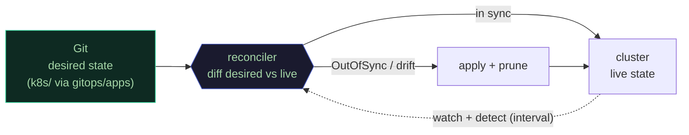
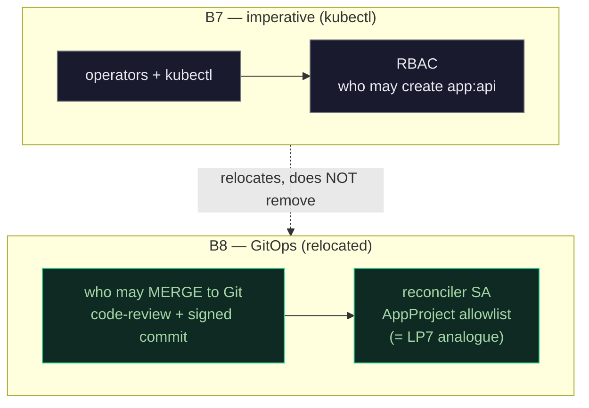
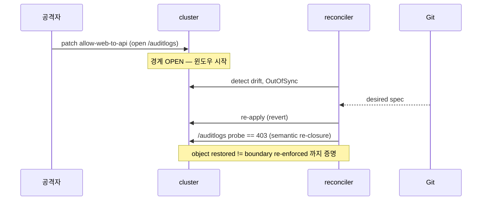
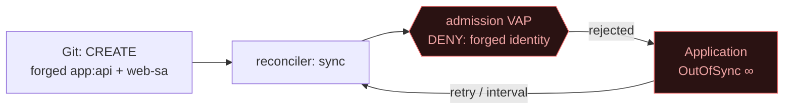

# M10 — GitOps 무결성 통제판: reconciler가 곧 새 신원-TCB

<div class="lab-pills">
<span class="lab-progress">심화 / 측정·무결성</span> · <span class="lab-badge">스택 ArgoCD</span> · <span class="lab-badge">소요 ~40–60m</span> · <span class="lab-badge cluster">클러스터 필요 · RAM ~8–10GB</span> · <span class="lab-badge">비용 $0 로컬</span>
</div>

> **선행:** M2(신원 admission)·M3(Cilium netpol)·M9(침해 가정). M10은 그 통제들을 *다른 actor*(GitOps reconciler) 아래에서 다시 측정한다.
> **준비:** kind 스택(`scripts/up.*`) + `scripts/enable-gitops.sh`(ArgoCD 설치, opt-in). 없으면 SKIP(FAIL 아님).

**미션 — GitOps를 "배포 편의"가 아니라 *보안 결정*으로 다룬다.** 주니어는 "GitOps = Git이 진실원천"에서 멈춘다.
시니어가 가져갈 것은 **GitOps가 새 통제를 추가하지 않고 신원-TCB를 *이전*한다**는 것이다: B7의 *"누가 `app:web`
파드를 만드나"*(RBAC)가 GitOps 아래선 *"누가 repo에 머지하나 + reconciler SA가 무엇을 사칭/적용할 수 있나"*가
된다. M10의 일은 Git=진실원천을 파는 게 아니라 **그 이전을 라이브로 측정**하는 것 — drift 자동교정의 *윈도우*,
admission과의 *교착*, reconciler 권한의 *경계*, 그리고 GitOps가 *못* 막는 것.

## 1. reconcile 제어 루프 — drift는 "탐지 후 교정"이지 "방지"가 아니다



`selfHeal` back-edge(`W -.-> R`)가 무결성 통제의 핵심이다. 하지만 그 루프엔 **간격(sync interval)** 이 있다 —
교정은 즉시가 아니라 *탐지 후*다. 그래서 **"drift를 막는다"고 주장하지 않는다**; "drift를 `≤ sync interval`로
경계짓고 자동교정한다"만 주장한다(M8의 detection≠prevention을 *revert-latency*로 재측정). prevention-grade peer는
admission(VAP/Kyverno)이다.

## 2. 신뢰 경계의 *이전* (B7 → B8) — 가장 중요한 그림



GitOps의 audit-trail 이점은 진짜다 — 하지만 capability를 **CENTRALIZE해서** 추적성을 산다: *"많은 사람 + kubectl"*을
*"하나의 봇 + (구성상) 모든 권한 + git log"*로 맞바꾼다. 그래서 reconciler는 B7이 `shop:tier-operators`를 최소화했듯
**최소화돼야** 한다. `k8s/rbac.yaml`이 이미 예고했다 — *"map this Group to your privileged GitOps controller"*.
`gitops/projects/shop-project.yaml`(AppProject)이 그 reach를 allowlist하고, `scripts/check-reconciler-rbac.py`가
정적으로, `--live`가 `kubectl auth can-i`로 *실효* 권한을 증명한다.

## 라이브로 측정하는 것 (try → 경계 통제 → 기대)

| 시도 (공격자/기여자) | 경계 통제 | 기대 결과 |
|---|---|---|
| `kubectl patch`로 allow-web-to-api에 `/auditlogs` 개방 | reconciler selfHeal | `≤ interval` 내 revert + **`/auditlogs == 403` 재폐쇄**(L1) |
| 위조 `app:api`+`web-sa`를 **Git에 머지** | admission(VAP) | reconciler 영원히 **OutOfSync**, pod **absent**, VAP 거부 메시지(L2) |
| reconciler가 clusterrolebinding/secret 취득 시도 | AppProject + RBAC | **DENY**(L3) — 단 ciliumnetworkpolicy patch는 ALLOW(tight≠broken) |
| **un-tracked** ns에 rogue NetworkPolicy 생성 | (없음 — 음성 통제) | sync 후에도 **SURVIVES**(L6, drift-correction은 universal 아님) |

## 3. drift → revert 시퀀스



핵심 정직성: **spec-equality ≠ 의미적 재폐쇄.** 되돌린 객체가 git과 spec-match해도 잘못 집행할 수 있다 —
그래서 L1은 revert 후 `verify.sh`의 `web→api GET /auditlogs == 403` 프로브를 *재실행*해 *경계가 실제로 다시
닫혔는지* 증명한다. 관측된 TTR(time-to-revert)는 **INFO로만** 기록한다(graded 숫자 아님 — M8 iron rule).

## 4. fighting controllers — admission이 나쁜-Git을 막고 reconciler는 영원히 진다 (flagship)



주니어는 GitOps+admission이 깔끔히 compose한다 가정하지만, 하드-원 진실은 **둘이 교착(livelock)** 한다는 것이다:
reconciler의 desired-state(Git의 나쁜 manifest)가 클러스터 policy-state(admission)에 영구 거부되고, ArgoCD는 매
interval마다 retry해 soft-DoS 등가를 태운다 — **절대 Synced에 닿지 못한다.** 이게 안전-실패가 아니라 *측정 가능한
병리*다. grade.sh는 false-pass를 막으려 **3가지를 동시 단언**한다: (a) Application=`OutOfSync` & operation=`Failed`,
(b) 위조 pod가 클러스터에 **부재**, (c) operation 메시지가 VAP 고유 거부 문자열 포함(RBAC 403/apiserver-down이
admission 거부로 위장 못하게 — `verify.sh`의 grep 기법).

> **더 어두운 변종(repo 자체 발견):** `k8s/admission-sa-use.yaml`이 `system:serviceaccount:kube-system:*`를 admit한다.
> reconciler가 **kube-system SA로 돌면 SA-use 게이트를 조용히 우회**한다 → GitOps가 B7의 한 링크를 무력화. 완화는
> reconciler를 **named·non-kube-system·minimally-scoped SA**로 돌리는 것(새 TCB도 B7처럼 최소화). vuln이 아니라
> *"새 통제를 들일 때 그게 기존 통제의 EXEMPT에 들어가는지 보라"*는 가장 날카로운 교훈.

## 직접 채워보기 (strip → rebuild)

학습자는 `labs/m10/application.yaml`의 **load-bearing 한 줄들**을 재구현하고 `labs/m10/grade.sh`(+`grade.py`
무클러스터)가 canonical(`gitops/apps/*.yaml`) 대조: **destination scope**, **`syncPolicy.automated{prune, selfHeal}`**,
**`sync-wave` 숫자**. `selfHeal:false`면 drift가 살아남고(L1 BREACH), wave를 scramble하면 SA-not-found(L5 FAIL) —
M2식 *"한 줄이 통제다"*. 떠먹여주는 모드는 [LEARN.md](LEARN.md). **복붙하면 채점기는 통과해도 유일하게 측정되는
것(네 이해)이 사라진다.**

## 왜 헤드라인이 (거의) 안 변하나

> **GitOps 대부분은 ops/instrumentation이거나 기존 통제의 *재계측*이지 새 VERIFIED 행이 아니다.** 기본값으로
> 헤드라인 **82.5%(33/40)는 이 모듈로 바뀌지 않는다.** 추가 후보는 단 1행 — **IN1**(새 family `integrity`,
> "drift auto-reverted within sync interval") — 이고, 그조차 정직하게: CI hard-gate면 VERIFIED(→82.9%), 로컬
> 랩 grader만이면 CONFIGURED(→**80.5%**, denominator +1이 비율을 *먼저* 떨어뜨림 — ID8의 "증명 전엔 claim 안 함"
> 방향). L2~L5는 기존 ID1/SL6/B7의 property를 새 actor로 재측정 — evidence 강화지 새 행 아님. **모듈의 가치는
> coverage가 아니라 깊이다.** 행 추가/승격은 오너 결정 → [ADR 0002](../../docs/decisions/0002-argocd-gitops-relocates-identity-tcb.md).

## ArgoCD 대시보드 (정직: 라이브 UI는 ship 못 하고, 스크린샷도 위조 안 함)

정적 사이트라 살아있는 ArgoCD 패널을 임베드하지 않고 **스크린샷도 위조하지 않는다.** 대신 대시보드가 *렌더하는
원천*인 CLI 출력을 보여준다(직접 재현 가능):

```text
$ argocd app get shop-network-runtime     # L1 drift 중
Sync Status:  OutOfSync (drift)   Health: Healthy
cilium.io  CiliumNetworkPolicy  allow-web-to-api  OutOfSync   # reconciler가 곧 revert
$ argocd app get m10-forge                # L2 fighting-controllers
Sync Status:  OutOfSync          Health: Missing
Condition: SyncError — admission webhook denied: forged identity (app:api on web-sa)
```

시각적 before/after(신뢰 경계 이전·3-posture·정직한 한계)는 → [발표 페이지](../../presentation/gitops-trust-shift.html).
왜 Flux 아닌 ArgoCD인지(대시보드가 곧 이 랩 주제의 *그림*이지만, ArgoCD 자체가 net-new 공격표면)는 [ADR 0002](../../docs/decisions/0002-argocd-gitops-relocates-identity-tcb.md).

## 범위 밖 / 못 막는 것 (정직)

- **bootstrap 역설:** GitOps는 자기 자신을 못 띄운다 — ArgoCD+root App은 terraform/admin kubectl(push, cluster-admin)이 설치. trust-root는 여전히 push-model.
- **reconciler는 OWN 안 한 걸 못 되돌린다:** un-tracked ns의 rogue 객체는 invisible(L6 음성 통제로 실측).
- **compromised Git / signed-but-malicious PR:** 설계상 in-scope-of-trust — reconciler는 공격자 의도를 충실히 적용. GitOps는 trust를 *이전*하지 *생성*하지 않는다.
- **ArgoCD 컨트롤플레인 자체가 공격표면:** `argocd-server` 침해 = 모든 synced ns write. THREAT_MODEL이 disclose([B8](../../THREAT_MODEL.md)).

## 구두 문답

1. <details><summary>GitOps는 "새 보안 통제"인가?</summary>아니다 — *이전*이다. B7의 "누가 파드를 만드나"가 "누가 머지하나 + reconciler가 무엇을 적용하나"가 된다. 새로 *추가*되는 통제는 딱 하나: drift-correction(런타임 무결성, detection·prevention과 구별되는 correction).</details>
2. <details><summary>drift-correction은 "방지"인가?</summary>아니다. 탐지-후-교정이라 sync interval만큼 윈도우가 있다(그 동안 edit가 LIVE). "막는다" 금지 — "≤ interval로 경계짓고 자동교정"만. prevention-grade는 admission.</details>
3. <details><summary>되돌렸으면 경계가 다시 닫힌 것 아닌가?</summary>spec-equality ≠ 의미적 재폐쇄. 그래서 revert 후 `/auditlogs==403` 프로브를 재실행해 *집행*까지 증명한다.</details>
4. <details><summary>admission이 나쁜-Git을 막으면 안전-실패 아닌가?</summary>안전하지만 *교착*이다 — Application이 영원히 OutOfSync로 retry(soft-DoS). 측정 가능한 병리이지 깔끔한 거부가 아니다.</details>
5. <details><summary>reconciler를 cluster-admin으로 두면 왜 위험한가?</summary>구성상 app:api를 mint하고, 그걸 지키는 VAP를 다시 쓰고, 네 사고대응 edit를 되돌릴 수 있다 = 재중앙화된 B7. AppProject로 최소화해야(LP7 analogue).</details>
6. <details><summary>왜 헤드라인이 안 변하나?</summary>대부분 재계측. IN1 1행이 최대고, 기본 CONFIGURED면 denominator+1로 비율이 *떨어진다* — 부풀리기의 반대. 가치는 coverage가 아니라 깊이.</details>
7. <details><summary>reconciler를 kube-system SA로 돌리면?</summary>admission-sa-use가 kube-system을 EXEMPT라 SA-use 게이트를 우회한다 → named·minimally-scoped SA로 돌려 게이트가 reconciler에도 적용되게.</details>
8. <details><summary>GitOps가 못 막는 건?</summary>compromised Git/악성 PR(in-scope-of-trust), un-tracked 객체, bootstrap trust-root(push-model), ArgoCD 자체의 공격표면.</details>

## 실행 (opt-in, 클러스터)

```bash
bash scripts/enable-gitops.sh      # ArgoCD 설치 + root-app 1회 apply ("마지막 imperative act")
bash labs/m10/grade.sh             # L1 drift-revert+403 / L2 fighting-controllers / L3-live / L6 음성 — HELD/BREACH
# 무클러스터(졸업-critical 절반): python labs/m10/grade.py  (application.yaml 정적 채점)
```

> 무클러스터로도 항상 CI-게이트되는 절반: `python scripts/check-reconciler-rbac.py`(L3 정적) · `python scripts/check-sync-wave-order.py`(L5).
